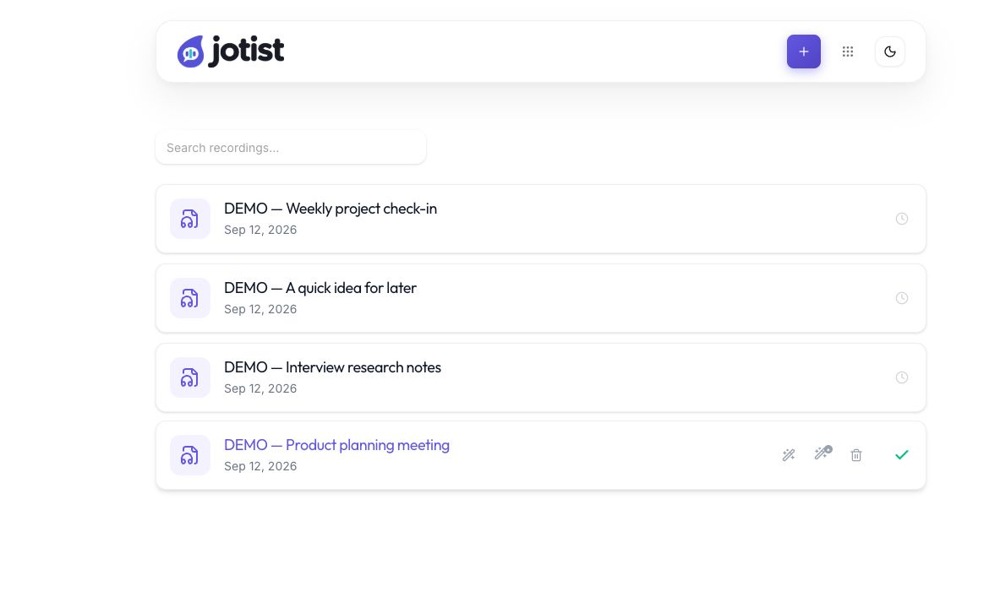

<div align="center">
  <picture>
    <source media="(prefers-color-scheme: dark)" srcset="assets/brand/jotist-logo-dark.svg" />
    
  </picture>
  <p>Self-hosted audio transcription, with your recordings and workflow under your control.</p>
  <p><a href="https://github.com/jaysqvl/Jotist/releases">Releases</a> · <a href="docs/jotist-migration.md">Migration guide</a> · <a href="docs/jotist-releases.md">Release and deployment guide</a> · <a href="ATTRIBUTION.md">Attribution</a></p>
</div>

Jotist turns audio and video into searchable transcripts, speaker labels, notes, and summaries. Run local speech models on your own server, compare preserved transcription attempts, and choose the model and execution settings that suit your hardware.

This is Jay Esquivel's independently maintained continuation of [Scriberr](https://github.com/rishikanthc/Scriberr), created by Rishikanth Chandrasekaran and the upstream contributors. Jotist preserves that history and the original [MIT license](LICENSE).

<picture>
  <source media="(prefers-color-scheme: dark)" srcset="web/project-site/public/screenshots/jotist-library-dark.png" />
  
</picture>

*Jotist’s recording library. All recordings shown are synthetic demo content.*

## What you can do

- Transcribe recordings with local models, including Whisper, NVIDIA Parakeet and Canary, and the additional adapters in the model catalog.
- Save profiles, recognition vocabulary, and meeting context; compare model capabilities and published benchmark metadata before choosing a configuration.
- Preserve multiple transcription runs, compare transcripts, pin the active result, and queue profiles sequentially for each recording.
- Inspect execution stages and recover supported interrupted work using the available recovery controls.
- Resume browser and CLI uploads with chunk checksums and configured capacity limits.
- Read transcripts alongside audio playback, edit speaker labels, add notes, and create summaries or chat with your recordings.
- Use the API, folder-watching CLI, or install the web interface as a PWA.

Local transcription processes audio on your server. Optional cloud transcription sends audio to the selected provider; optional summaries and chat send content to the configured LLM provider. Model files and runtime dependencies may require downloads. Model support and hardware requirements vary: see the in-app catalog and [model comparison notes](docs/model-comparison.md).

## Run with Docker

**Jotist 1.7.0** provides CPU and CUDA 12.6 container variants. The release includes the corrected runtime upgrade path: retained lockfiles are refreshed and obsolete packages are removed during environment preparation. See the [release notes](https://github.com/jaysqvl/Jotist/releases/tag/v1.7.0) for installation and qualification details.

| Hardware | Versioned image |
| --- | --- |
| CPU | `ghcr.io/jaysqvl/jotist:1.7.0` |
| CUDA 12.6-compatible NVIDIA GPU | `ghcr.io/jaysqvl/jotist:1.7.0-cuda` |
| Blackwell / RTX 50-series | Local CUDA 13 source build only; actual inference remains unqualified |

Selected CPU and CUDA 12.6 model pipelines passed prior runtime qualification, including retained-environment migration checks. Qualify the selected released image with your own data and runtimes before cutover. Blackwell source builds have dependency-resolution and native-library checks, but no actual Blackwell inference qualification; they are excluded from the default stable image publication.

Published container builds currently target **Linux amd64**. Release archives provide Linux, macOS, and Windows server binaries for amd64 and arm64; availability of optional model runtimes depends on the platform.

For a new CPU installation:

```bash
git clone https://github.com/jaysqvl/Jotist.git
cd Jotist
docker compose up -d
```

Open [localhost:8080](http://localhost:8080), then create the first account. For CUDA 12.6, use `docker compose -f docker-compose.cuda.yml up -d` with a compatible host driver and NVIDIA Container Toolkit. To build locally, use `docker-compose.build.yml` or `docker-compose.build.cuda.yml` with `up -d --build`. The optional `docker-compose.build.blackwell.yml` is for unqualified Blackwell source-build evaluation.

**Existing Scriberr installation:** follow the [migration guide](docs/jotist-migration.md) before starting a stack from a new directory. Preserve the existing database, uploads, JWT secret, model storage, and Compose volume mapping. A different Compose project name can create empty named volumes instead of opening your existing data.

Use a digest-pinned image for deployments you need to reproduce. Release workflow summaries report the exact image digest and source commit; see the [release guide](docs/jotist-releases.md).

Maintainers who want to follow unreleased `main` changes can use
`ghcr.io/jaysqvl/jotist:dev-cuda`. Successful development builds update this CUDA
12.6 channel after validation; updating the running container remains a separate
step. See the [development channel instructions](docs/jotist-releases.md#rolling-development-image)
for adopting an already qualified image and retaining a rollback digest.

## Configuration

The server reads environment variables and an optional `.env` file in its working directory. Docker images supply production defaults.

| Variable | Purpose | Default outside Docker |
| --- | --- | --- |
| `HOST`, `PORT` | Listening interface and port | `0.0.0.0`, `8080` |
| `APP_ENV` | Application environment | `development` |
| `DATABASE_PATH` | SQLite database; legacy filename retained | `data/scriberr.db` |
| `UPLOAD_DIR`, `TRANSCRIPTS_DIR` | Recordings and transcript storage | `data/uploads`, `data/transcripts` |
| `WHISPERX_ENV` | Managed Python/model runtime storage | `data/whisperx-env` |
| `JWT_SECRET`, `JWT_SECRET_FILE` | Existing signing secret or persistent secret file | Generated at `data/jwt_secret` when unset |
| `HF_TOKEN` | Optional Hugging Face access token | Empty |
| `OPENAI_API_KEY` | Optional cloud provider key | Empty |
| `ALLOWED_ORIGINS` | Comma-separated browser origins | Local development origins |
| `TRUSTED_PROXIES` | Trusted proxy IPs/CIDRs for forwarded headers | None |
| `SECURE_COOKIES` | Cookie transport mode | `auto` |
| `PUID`, `PGID` | Container runtime UID/GID | `1000`, `1000` |

The existing upload, authentication, media concurrency, timeout, and runtime environment settings remain supported. Keep your current values when migrating. Gated models may require both a token and acceptance of their model terms.

## Server binary and CLI

Download a platform archive from [Jotist Releases](https://github.com/jaysqvl/Jotist/releases), extract it, and run `jotist`. Model execution also needs the appropriate Python, uv, FFmpeg, and optional accelerator/runtime dependencies; Docker includes the common system dependencies.

The separate folder-watching CLI still uses the command **`scriberr`** in this compatibility release. Install it from the Jotist application's **Settings → CLI** page. Existing `~/.scriberr.yaml`, `SCRIBERR_*` environment variables, installed watcher service, and saved sessions remain supported. The upstream Homebrew tap installs Scriberr, not Jotist.

## Development

Use the Go version in `go.mod`, Node.js 24, and the Python/uv runtimes required by the selected models.

```bash
cd web/frontend
npm ci
cd ../..
make build
./bin/jotist
```

The Go module name remains `scriberr` to avoid an unrelated import rewrite. `make dev` runs Vite and the backend, using Air when it is already installed. `make docs` regenerates API documentation; `make build-cli` produces the compatible CLI downloads. See [Contributing](CONTRIBUTING.md) for the development checks and [source ownership](docs/architecture.md) for where changes belong.

See [local speech validation](docs/local-speech-validation.md), [recoverable transcription](docs/recoverable-transcription.md), and the [release guide](docs/jotist-releases.md) for implementation and validation details. A listed model or passing unit test is not a promise of successful inference on every machine.

## License and origin

Jotist is distributed under the [MIT license](LICENSE). It retains Scriberr's copyright and permission notice. MIT permits modification, redistribution, and commercial use subject to its terms; model weights and third-party components have their own licenses. See [ATTRIBUTION.md](ATTRIBUTION.md).
