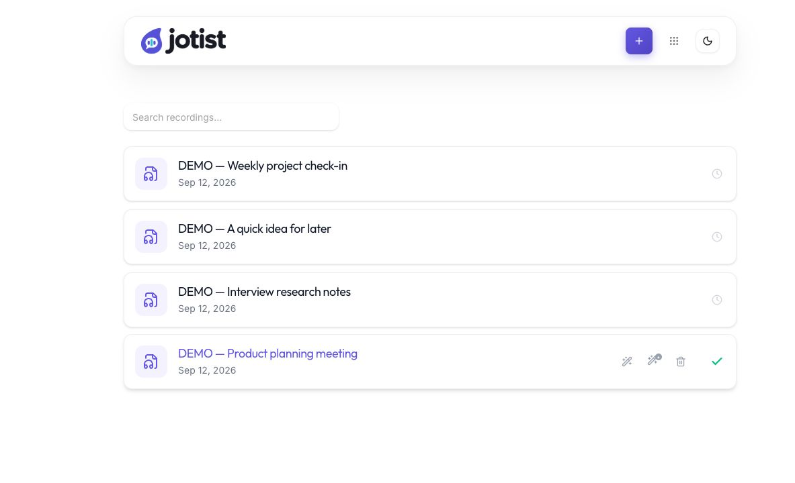

<div align="center">
  <picture>
    <source media="(prefers-color-scheme: dark)" srcset="assets/brand/jotist-logo-dark.svg" />
    
  </picture>
  <p>Self-hosted audio transcription, with your recordings and workflow under your control.</p>
  <p><a href="https://github.com/jaysqvl/Jotist/releases">Releases</a> · <a href="docs/jotist-migration.md">Migration guide</a> · <a href="docs/jotist-releases.md">Release and deployment guide</a> · <a href="ATTRIBUTION.md">Attribution</a></p>
</div>

Jotist turns audio and video into searchable transcripts, speaker labels, notes, and summaries. Run local speech models on your own server, compare preserved transcription attempts, and choose the model and execution settings that suit your hardware.

This is Jay Esquivel's independently maintained continuation of [Scriberr](https://github.com/rishikanthc/Scriberr), created by Rishikanth Chandrasekaran and the upstream contributors. Jotist preserves that history and the original [MIT license](LICENSE).

<picture>
  <source media="(prefers-color-scheme: dark)" srcset="web/project-site/public/screenshots/jotist-library-dark.png" />
  
</picture>

*Jotist’s recording library. All recordings shown are synthetic demo content.*

## What you can do

- Transcribe recordings with local models, including Whisper, NVIDIA Parakeet and Canary, and the additional adapters in the model catalog.
- Save profiles, recognition vocabulary, and meeting context; compare model capabilities and published benchmark metadata before choosing a configuration.
- Preserve multiple transcription runs, compare transcripts, pin the active result, and queue profiles sequentially for each recording.
- Inspect execution stages and recover supported interrupted work using the available recovery controls.
- Resume browser and CLI uploads with chunk checksums and configured capacity limits.
- Read transcripts alongside audio playback, edit speaker labels, add notes, and create summaries or chat with your recordings.
- Use the API, folder-watching CLI, or install the web interface as a PWA.

Local transcription processes audio on your server. Optional cloud transcription sends audio to the selected provider; optional summaries and chat send content to the configured LLM provider. Model files and runtime dependencies may require downloads. Model support and hardware requirements vary: see the in-app catalog and [model comparison notes](docs/model-comparison.md).

## GPU runtime and memory: one hour of audio

We ran a single **59m 48.82s English recording** through 17 recognition configurations and six external diarizers, plus native MOSS. This is an anecdotal measurement on one recording, using [Jotist v1.8.0](https://github.com/jaysqvl/Jotist/commit/3e71872ab6e5c19ccd3a0dd7115fdf615d1d7cdd) on September 29–30, 2026.

**Hardware:** NVIDIA RTX 3060 with 12 GiB VRAM · AMD Ryzen 7 5700G, 8 cores / 16 threads · 64 GiB installed RAM.

**Time** is minutes:seconds per audio hour. **Peak** and **Avg** are whole-card VRAM in GiB; Avg is weighted by sampled CUDA-stage time. Scroll horizontally to compare diarizers. **†** marks completed runs whose timed end coverage was unconfirmed.

<table>
<thead>
<tr>
<th rowspan="2">Recognition configuration</th>
<th colspan="3">DiariZen</th>
<th colspan="3">Pyannote&nbsp;3.1</th>
<th colspan="3">Pyannote&nbsp;Community&#8209;1</th>
<th colspan="3">Sortformer&nbsp;v2.1</th>
<th colspan="3">SUPlime</th>
<th colspan="3">SUPlime-L</th>
</tr>
<tr>
<th>Time</th>
<th>Peak</th>
<th>Avg</th>
<th>Time</th>
<th>Peak</th>
<th>Avg</th>
<th>Time</th>
<th>Peak</th>
<th>Avg</th>
<th>Time</th>
<th>Peak</th>
<th>Avg</th>
<th>Time</th>
<th>Peak</th>
<th>Avg</th>
<th>Time</th>
<th>Peak</th>
<th>Avg</th>
</tr>
</thead>
<tbody>
<tr>
<th scope="row">Parakeet&nbsp;TDT&nbsp;0.6B&nbsp;v3</th>
<td align="right"><strong>6:27</strong></td>
<td align="right">6.29</td>
<td align="right">1.23</td>
<td align="right"><strong>4:11</strong></td>
<td align="right">11.43</td>
<td align="right">2.33</td>
<td align="right"><strong>3:53</strong></td>
<td align="right">11.43</td>
<td align="right">2.43</td>
<td align="right"><strong>2:49</strong></td>
<td align="right">6.29</td>
<td align="right">1.86</td>
<td align="right"><strong>9:53</strong></td>
<td align="right">7.12</td>
<td align="right">6.46</td>
<td align="right"><strong>11:33</strong></td>
<td align="right">10.44</td>
<td align="right">9.47</td>
</tr>
<tr>
<th scope="row">Whisper&nbsp;large&#8209;v3&nbsp;·&nbsp;default</th>
<td align="right"><strong>8:05</strong></td>
<td align="right">8.71</td>
<td align="right">2.09</td>
<td align="right"><strong>4:52</strong></td>
<td align="right">11.43</td>
<td align="right">3.70</td>
<td align="right"><strong>4:33</strong></td>
<td align="right">11.43</td>
<td align="right">3.82</td>
<td align="right"><strong>3:17</strong></td>
<td align="right">8.62</td>
<td align="right">3.98</td>
<td align="right"><strong>11:03</strong></td>
<td align="right">8.83</td>
<td align="right">6.59</td>
<td align="right"><strong>12:42</strong></td>
<td align="right">10.44</td>
<td align="right">9.29</td>
</tr>
<tr>
<th scope="row">Whisper&nbsp;large&#8209;v3&nbsp;·&nbsp;custom&nbsp;prompt</th>
<td align="right"><strong>8:56†</strong></td>
<td align="right">4.83</td>
<td align="right">2.08</td>
<td align="right"><strong>5:42†</strong></td>
<td align="right">11.43</td>
<td align="right">3.38</td>
<td align="right"><strong>6:29†</strong></td>
<td align="right">11.43</td>
<td align="right">3.23</td>
<td align="right"><strong>4:22†</strong></td>
<td align="right">4.80</td>
<td align="right">3.48</td>
<td align="right"><strong>12:14†</strong></td>
<td align="right">7.12</td>
<td align="right">6.12</td>
<td align="right"><strong>13:54†</strong></td>
<td align="right">10.44</td>
<td align="right">8.63</td>
</tr>
<tr>
<th scope="row">Canary&nbsp;1B&nbsp;v2&nbsp;·&nbsp;FP16/40s</th>
<td align="right"><strong>8:16</strong></td>
<td align="right">2.93</td>
<td align="right">1.09</td>
<td align="right"><strong>5:22</strong></td>
<td align="right">11.43</td>
<td align="right">1.83</td>
<td align="right"><strong>9:03</strong></td>
<td align="right">11.43</td>
<td align="right">1.47</td>
<td align="right"><strong>9:00</strong></td>
<td align="right">4.01</td>
<td align="right">0.66</td>
<td align="right"><strong>11:36</strong></td>
<td align="right">7.12</td>
<td align="right">5.51</td>
<td align="right"><strong>13:30</strong></td>
<td align="right">10.44</td>
<td align="right">8.06</td>
</tr>
<tr>
<th scope="row">Canary&nbsp;1B&nbsp;v2&nbsp;·&nbsp;BF16/full</th>
<td align="right"><strong>7:09†</strong></td>
<td align="right">8.38</td>
<td align="right">1.19</td>
<td align="right"><strong>5:04†</strong></td>
<td align="right">11.43</td>
<td align="right">1.90</td>
<td align="right"><strong>3:43†</strong></td>
<td align="right">11.43</td>
<td align="right">2.63</td>
<td align="right"><strong>1:42†</strong></td>
<td align="right">8.38</td>
<td align="right">2.67</td>
<td align="right"><strong>9:40†</strong></td>
<td align="right">8.38</td>
<td align="right">6.57</td>
<td align="right"><strong>11:24†</strong></td>
<td align="right">10.44</td>
<td align="right">9.52</td>
</tr>
<tr>
<th scope="row">Canary&nbsp;Qwen&nbsp;2.5B</th>
<td align="right"><strong>11:20</strong></td>
<td align="right">5.10</td>
<td align="right">2.54</td>
<td align="right"><strong>9:02</strong></td>
<td align="right">11.43</td>
<td align="right">3.29</td>
<td align="right"><strong>9:13</strong></td>
<td align="right">11.43</td>
<td align="right">3.47</td>
<td align="right"><strong>6:54</strong></td>
<td align="right">5.10</td>
<td align="right">3.77</td>
<td align="right"><strong>14:20</strong></td>
<td align="right">7.12</td>
<td align="right">5.83</td>
<td align="right"><strong>15:49</strong></td>
<td align="right">10.44</td>
<td align="right">8.11</td>
</tr>
<tr>
<th scope="row">Cohere&nbsp;Transcribe</th>
<td align="right"><strong>7:26</strong></td>
<td align="right">4.46</td>
<td align="right">1.44</td>
<td align="right"><strong>4:52</strong></td>
<td align="right">11.43</td>
<td align="right">2.53</td>
<td align="right"><strong>4:21</strong></td>
<td align="right">11.43</td>
<td align="right">2.68</td>
<td align="right"><strong>2:42</strong></td>
<td align="right">4.46</td>
<td align="right">2.68</td>
<td align="right"><strong>10:24</strong></td>
<td align="right">7.12</td>
<td align="right">6.35</td>
<td align="right"><strong>12:03</strong></td>
<td align="right">10.44</td>
<td align="right">9.18</td>
</tr>
<tr>
<th scope="row">Granite&nbsp;5.0&nbsp;470M</th>
<td align="right"><strong>5:57</strong></td>
<td align="right">2.32</td>
<td align="right">0.83</td>
<td align="right"><strong>4:02</strong></td>
<td align="right">11.43</td>
<td align="right">1.59</td>
<td align="right"><strong>3:48</strong></td>
<td align="right">11.43</td>
<td align="right">1.93</td>
<td align="right"><strong>1:29</strong></td>
<td align="right">4.01</td>
<td align="right">0.73</td>
<td align="right"><strong>9:18</strong></td>
<td align="right">7.12</td>
<td align="right">6.56</td>
<td align="right"><strong>11:00</strong></td>
<td align="right">10.44</td>
<td align="right">9.63</td>
</tr>
<tr>
<th scope="row">Granite&nbsp;5.0&nbsp;470M&nbsp;NC</th>
<td align="right"><strong>5:51</strong></td>
<td align="right">2.32</td>
<td align="right">0.83</td>
<td align="right"><strong>3:23</strong></td>
<td align="right">11.43</td>
<td align="right">1.94</td>
<td align="right"><strong>3:48</strong></td>
<td align="right">11.43</td>
<td align="right">1.68</td>
<td align="right"><strong>1:30</strong></td>
<td align="right">3.85</td>
<td align="right">0.76</td>
<td align="right"><strong>9:31</strong></td>
<td align="right">7.12</td>
<td align="right">6.47</td>
<td align="right"><strong>11:10</strong></td>
<td align="right">10.44</td>
<td align="right">9.54</td>
</tr>
<tr>
<th scope="row">Granite&nbsp;4.1&nbsp;2B</th>
<td align="right"><strong>10:31</strong></td>
<td align="right">4.65</td>
<td align="right">2.30</td>
<td align="right"><strong>8:18</strong></td>
<td align="right">11.43</td>
<td align="right">3.01</td>
<td align="right"><strong>7:03</strong></td>
<td align="right">11.43</td>
<td align="right">3.44</td>
<td align="right"><strong>5:28</strong></td>
<td align="right">4.65</td>
<td align="right">3.72</td>
<td align="right"><strong>13:16</strong></td>
<td align="right">7.12</td>
<td align="right">5.99</td>
<td align="right"><strong>14:54</strong></td>
<td align="right">10.44</td>
<td align="right">8.32</td>
</tr>
<tr>
<th scope="row">Granite&nbsp;4.1&nbsp;2B&nbsp;Plus</th>
<td align="right"><strong>31:50</strong></td>
<td align="right">4.41</td>
<td align="right">3.68</td>
<td align="right"><strong>28:04</strong></td>
<td align="right">11.43</td>
<td align="right">4.08</td>
<td align="right"><strong>29:40</strong></td>
<td align="right">11.43</td>
<td align="right">4.09</td>
<td align="right"><strong>27:17</strong></td>
<td align="right">4.30</td>
<td align="right">4.15</td>
<td align="right"><strong>34:36</strong></td>
<td align="right">7.12</td>
<td align="right">4.91</td>
<td align="right"><strong>36:33</strong></td>
<td align="right">10.44</td>
<td align="right">5.92</td>
</tr>
<tr>
<th scope="row">Qwen3&nbsp;ASR&nbsp;0.6B</th>
<td align="right"><strong>9:37</strong></td>
<td align="right">2.32</td>
<td align="right">1.30</td>
<td align="right"><strong>7:50</strong></td>
<td align="right">11.43</td>
<td align="right">1.98</td>
<td align="right"><strong>6:35</strong></td>
<td align="right">11.43</td>
<td align="right">2.01</td>
<td align="right"><strong>6:24</strong></td>
<td align="right">4.02</td>
<td align="right">1.54</td>
<td align="right"><strong>13:38</strong></td>
<td align="right">7.12</td>
<td align="right">5.08</td>
<td align="right"><strong>14:40</strong></td>
<td align="right">10.44</td>
<td align="right">7.68</td>
</tr>
<tr>
<th scope="row">Qwen3&nbsp;ASR&nbsp;1.7B</th>
<td align="right"><strong>9:59</strong></td>
<td align="right">4.42</td>
<td align="right">2.28</td>
<td align="right"><strong>7:20</strong></td>
<td align="right">11.43</td>
<td align="right">3.25</td>
<td align="right"><strong>6:58</strong></td>
<td align="right">11.43</td>
<td align="right">3.31</td>
<td align="right"><strong>5:35</strong></td>
<td align="right">4.40</td>
<td align="right">3.46</td>
<td align="right"><strong>13:14</strong></td>
<td align="right">7.12</td>
<td align="right">5.88</td>
<td align="right"><strong>14:52</strong></td>
<td align="right">10.44</td>
<td align="right">8.25</td>
</tr>
<tr>
<th scope="row">Ark&nbsp;3B</th>
<td align="right"><strong>10:34</strong></td>
<td align="right">7.58</td>
<td align="right">3.44</td>
<td align="right"><strong>7:26</strong></td>
<td align="right">11.43</td>
<td align="right">4.96</td>
<td align="right"><strong>7:22</strong></td>
<td align="right">11.43</td>
<td align="right">4.94</td>
<td align="right"><strong>5:26</strong></td>
<td align="right">7.58</td>
<td align="right">5.83</td>
<td align="right"><strong>13:13</strong></td>
<td align="right">7.58</td>
<td align="right">6.86</td>
<td align="right"><strong>14:56</strong></td>
<td align="right">10.44</td>
<td align="right">9.04</td>
</tr>
<tr>
<th scope="row">Voxtral&nbsp;Mini&nbsp;3B</th>
<td align="right"><strong>10:42</strong></td>
<td align="right">9.18</td>
<td align="right">4.29</td>
<td align="right"><strong>8:06</strong></td>
<td align="right">11.43</td>
<td align="right">5.87</td>
<td align="right"><strong>7:58</strong></td>
<td align="right">11.43</td>
<td align="right">5.94</td>
<td align="right"><strong>6:25</strong></td>
<td align="right">9.18</td>
<td align="right">6.61</td>
<td align="right"><strong>13:39</strong></td>
<td align="right">9.18</td>
<td align="right">7.40</td>
<td align="right"><strong>15:19</strong></td>
<td align="right">10.44</td>
<td align="right">9.51</td>
</tr>
<tr>
<th scope="row">MOSS&nbsp;Preview&nbsp;2B</th>
<td align="right"><strong>10:06</strong></td>
<td align="right">5.26</td>
<td align="right">2.64</td>
<td align="right"><strong>8:18</strong></td>
<td align="right">11.43</td>
<td align="right">3.66</td>
<td align="right"><strong>6:56</strong></td>
<td align="right">11.43</td>
<td align="right">3.77</td>
<td align="right"><strong>6:17</strong></td>
<td align="right">5.26</td>
<td align="right">4.01</td>
<td align="right"><strong>14:13</strong></td>
<td align="right">7.12</td>
<td align="right">5.96</td>
<td align="right"><strong>15:49</strong></td>
<td align="right">10.44</td>
<td align="right">8.17</td>
</tr>
<tr>
<th scope="row">MOSS&nbsp;0.9B</th>
<td colspan="3" align="center">Failed</td>
<td colspan="3" align="center">Failed</td>
<td colspan="3" align="center">Failed</td>
<td colspan="3" align="center">Failed</td>
<td colspan="3" align="center">Failed</td>
<td colspan="3" align="center">Failed</td>
</tr>
</tbody>
</table>

Parakeet + Sortformer completed in **2:49 per audio hour**, with **6.29 GiB peak / 1.86 GiB average VRAM**. Across the study, **96 of 103 cases completed on CUDA** without recorded retries or CPU fallback; **84 met the timed coverage check**. Pyannote variants reached **11.43 GiB** and SUPlime-L **10.44 GiB**, leaving tight memory margins on this card.

[Full numerical results (CSV)](docs/benchmarks/rtx3060-2026-09-30.csv) include exact elapsed time/RTF, configuration and checkpoint details, actual stage devices, recovery/fallback, failures, GPU and host memory, timed coverage, output counts, and contention evidence.

<details>
<summary>Method, configuration differences, and limitations</summary>

- **Timing:** processing start to terminal status, including worker/model startup and pipeline work, excluding queue wait. Per-hour time is `elapsed_seconds × 3600 / 3588.82`, rounded to the nearest second. Only time is normalized; memory is observed. Model/dependency caches were retained.
- **Memory:** Peak is the maximum observed whole-card usage across stages. Avg weights each CUDA stage attempt's average by its sampled duration, excluding unsampled gaps and queue wait. Both include any other GPU users; they are not model-only allocations. Workers had 10 logical CPUs available; the OS reported 60.7 GiB of usable host RAM. The CSV also records peak worker RSS and minimum host available memory.
- **Execution:** 81 fresh requests plus 22 matching earlier v1.8.0 outcomes. Requests ran sequentially on the recording, with checkpoint reuse and learning disabled. Recognition, alignment where needed, and external diarization were configured for CUDA; CPU fallback was forbidden. Smaller GPU batch recovery was allowed, but none was recorded in the completed cases. CPU-only BitNet was excluded.
- **Coverage:** valid timed output required positive segment/word counts and a final timestamp reaching at least 99.7% of the recording. Canary BF16/full had timestamps off. Whisper custom-prompt runs ended at 99.36%, leaving coverage unconfirmed; this alone does not establish missing speech.
- **Configurations:** Canary BF16/full and FP16/40s differ in precision, chunking, and timestamps. Whisper default used batch 8; custom prompt used batch 1. Timing differences cannot be attributed to the prompt alone. Exact checkpoints and settings are in the CSV; the recording, transcript, prompt, context, and vocabulary remain private.
- **Failures:** all seven MOSS 0.9B cases, including native MOSS, failed in alignment with `RecognitionError` / `application_ae1b7676702d` (outer error: `adapter_failed`). External diarizers were not reached. Failure timings and resource measurements are retained in the CSV.
- **Contention and headroom:** background work remained active. Per-stage GPU ownership was unresolved for every case; Granite 4.1 2B Plus / Community-1 recorded external contention. Of 96 completions, 48 had less than 15% VRAM headroom. None earns the strict comfortable label, which also requires full valid coverage, CUDA recognition and speakers, RTF ≤ 1, and no recovery/fallback/contention or unknown ownership.
- **Quality:** this is a runtime/resource study on one English recording. There is no human reference for WER/DER or multilingual evaluation, and different diarizers do not produce interchangeable speaker labels.
- **Separate stages:** supported pipelines run recognition, alignment, and external speaker assignment sequentially, releasing the preceding worker's model memory. Integrated timestamps or speakers can remain within recognition. The separate [Canary qualification](docs/canary-stage-qualification.md#measured-memory-and-failure-recovery) measured about 39% lower Torch allocator peak on a public 77.5-second fixture. This hour-long study has no matching before/after run to isolate staging's contribution.

</details>

## Run with Docker

**Jotist 1.7.3** provides CPU and CUDA 12.6 container variants. It recovers a Cohere Auto decoder cutoff by retrying only the affected audio window as two shorter parts. See the [release notes](https://github.com/jaysqvl/Jotist/releases/tag/v1.7.3) for details.

| Hardware | Versioned image |
| --- | --- |
| CPU | `ghcr.io/jaysqvl/jotist:1.7.3` |
| CUDA 12.6-compatible NVIDIA GPU | `ghcr.io/jaysqvl/jotist:1.7.3-cuda` |
| Blackwell / RTX 50-series | Local CUDA 13 source build only; actual inference remains unqualified |

Selected CPU and CUDA 12.6 model pipelines passed prior runtime qualification, including retained-environment migration checks. Qualify the selected released image with your own data and runtimes before cutover. Blackwell source builds have dependency-resolution and native-library checks, but no actual Blackwell inference qualification; they are excluded from the default stable image publication.

Published container builds currently target **Linux amd64**. Release archives provide Linux, macOS, and Windows server binaries for amd64 and arm64; availability of optional model runtimes depends on the platform.

For a new CPU installation:

```bash
git clone https://github.com/jaysqvl/Jotist.git
cd Jotist
docker compose up -d
```

Open [localhost:8080](http://localhost:8080), then create the first account. For CUDA 12.6, run `docker compose --project-directory . -f deploy/compose/cuda.yaml up -d` with a compatible host driver and NVIDIA Container Toolkit. See [container deployment](deploy/README.md) for local builds and the existing-install path mapping.

**Existing Scriberr installation:** follow the [migration guide](docs/jotist-migration.md) before starting a stack from a new directory. Preserve the existing database, uploads, JWT secret, model storage, and Compose volume mapping. A different Compose project name can create empty named volumes instead of opening your existing data.

Use a digest-pinned image for deployments you need to reproduce. Release workflow summaries report the exact image digest and source commit; see the [release guide](docs/jotist-releases.md).

Maintainers who want to follow unreleased `main` changes can use
`ghcr.io/jaysqvl/jotist:dev-cuda`. Successful development builds update this CUDA
12.6 channel after validation; updating the running container remains a separate
step. See the [development channel instructions](docs/jotist-releases.md#rolling-development-image)
for adopting an already qualified image and retaining a rollback digest.

## Configuration

The server reads environment variables and an optional `.env` file in its working directory. Docker images supply production defaults.

| Variable | Purpose | Default outside Docker |
| --- | --- | --- |
| `HOST`, `PORT` | Listening interface and port | `0.0.0.0`, `8080` |
| `APP_ENV` | Application environment | `development` |
| `DATABASE_PATH` | SQLite database | `data/jotist.db` |
| `UPLOAD_DIR`, `TRANSCRIPTS_DIR` | Recordings and transcript storage | `data/uploads`, `data/transcripts` |
| `WHISPERX_ENV` | Managed Python/model runtime storage | `data/whisperx-env` |
| `JWT_SECRET`, `JWT_SECRET_FILE` | Existing signing secret or persistent secret file | Generated at `data/jwt_secret` when unset |
| `HF_TOKEN` | Optional Hugging Face access token | Empty |
| `OPENAI_API_KEY` | Optional cloud provider key | Empty |
| `QUEUE_WORKERS` | Explicit recording concurrency override; locks the Settings control | Saved Settings limit, otherwise `1` |
| `ALLOWED_ORIGINS` | Comma-separated browser origins | Local development origins |
| `TRUSTED_PROXIES` | Trusted proxy IPs/CIDRs for forwarded headers | None |
| `SECURE_COOKIES` | Cookie transport mode | `auto` |
| `PUID`, `PGID` | Container runtime UID/GID | `1000`, `1000` |

The existing upload, authentication, media concurrency, timeout, and runtime environment settings remain supported. Keep your current values when migrating. Gated models may require both a token and acceptance of their model terms.

Recording runs share one worker by default. Set **Simultaneous recordings** in **Settings → Transcription → Processing queue** to change the limit across recordings. One is recommended for a single GPU. Changes are saved across restarts; lowering the limit lets active runs finish before starting more work. Each recording keeps its own run order. The run queue shows active work and the two latest queued runs across recordings. Every row names its recording, model and what it is waiting on. **Show all queued runs** expands the same list. Newest-first display does not change each recording’s processing order. New runs record the active stage number against their enabled execution boundaries; older runs without that metadata show the stage name.

## Server binary and CLI

Download a platform archive from [Jotist Releases](https://github.com/jaysqvl/Jotist/releases), extract it, and run the server as `./jotist-server` from its directory. Keep the included `bin/cli` directory beside the server so Settings can serve CLI downloads. Model execution also needs the appropriate Python, uv, FFmpeg, and optional accelerator/runtime dependencies; Docker includes the common system dependencies.

The CLI uses **`jotist`**. Install or update it from the Jotist application's **Settings → CLI** page. It uses `~/.jotist.yaml`, `JOTIST_*` environment variables, and the `jotist-watcher` service. See [CLI controls](docs/cli-controls.md) for commands and configuration. Existing installations should follow the [migration guide](docs/jotist-migration.md) before switching to the Jotist defaults.

## Development

Use the Go version in `go.mod`, Node.js 24, and the Python/uv runtimes required by the selected models.

```bash
cd web/frontend
npm ci
cd ../..
make build
./bin/jotist-server
```

The Go module is `github.com/jaysqvl/Jotist`. `make dev` runs Vite and the backend, using Air when it is already installed. `make docs` regenerates API documentation; `make build-cli` produces the Jotist CLI downloads. See [Contributing](CONTRIBUTING.md) for the development checks and [source ownership](docs/architecture.md) for where changes belong.

See [local speech validation](docs/local-speech-validation.md), [recoverable transcription](docs/recoverable-transcription.md), and the [release guide](docs/jotist-releases.md) for implementation and validation details. A listed model or passing unit test is not a promise of successful inference on every machine.

## License and origin

Jotist is distributed under the [MIT license](LICENSE). It retains Scriberr's copyright and permission notice. MIT permits modification, redistribution, and commercial use subject to its terms; model weights and third-party components have their own licenses. See [ATTRIBUTION.md](ATTRIBUTION.md).
