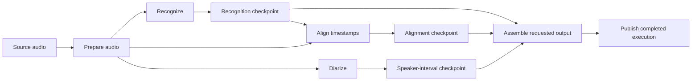

# Recoverable transcription and adaptive execution

Technical design document · Draft for review · 2026-09-12

This document proposes a recoverable pipeline and optional, progressively broader adaptation. It does not implement or authorize a production deployment. “TDD” here means technical design document; the validation section also defines implementation tests.

## 1. Decision summary

Scriberr should always save durable checkpoints at supported stage boundaries. Adaptation is independently optional. The user chooses the maximum kinds of execution changes Scriberr may make; the system never exceeds that permission level to finish a job.

The priorities, in order, are:

1. Preserve the selected models, recognition context, and quality settings.
2. Preserve completed work through failures and server restarts.
3. Fit work on the GPU by controlling concurrency, staging, and model residency.
4. Adjust batch size only when the adapter can do so without changing its context policy.
5. Use CPU execution only when the selected level and stage settings permit it.
6. Shorten audio windows only as an explicitly enabled last resort.

Learning improves estimates of how to execute a profile on particular hardware. It does not train the speech model, establish better recognition accuracy, or guarantee that every later run is faster.

**Initial product recommendation:** checkpoints on; adaptation off for existing profiles; offer **Level 1 — Stage management** as the first opt-in mode. Release broader levels only after their own validation gates pass.

## 2. Evidence and current constraints

Live inspection in this design discussion identified production image revision `105bfe3e2f7e868db6da4f6e54f72c075db81b84`, labelled `v1.6.1`, on an RTX 3060 with 12 GiB VRAM. These are an observed baseline, not a requirement to deploy that version. The local working tree contains additional, uncommitted changes and must not be treated as the deployed implementation.

The June 26 recording investigated in this discussion supplies a useful regression case:

| Attempt | Recognition configuration | Outcome |
| --- | --- | --- |
| 13:16 | Canary, BF16, batch 1, timestamps off, diarization off | Completed |
| 13:23 | Canary, BF16, batch 1, timestamps on, diarization off | Failed inside external CTC timestamp alignment |
| 14:15 | Canary, BF16, batch 1, timestamps off, diarization off | Completed |
| 16:40 | Canary-Qwen, diarization requested | Failed during an ONNX/`ml_dtypes` import, before inference |

The 13:23 attempt had explicit chunking disabled despite a 40-second chunk-duration value. At failure, its process occupied approximately 10.68 GiB and requested another 5.65 GiB. This was an alignment-memory failure, not evidence of concurrent diarization. The separate import problem must not train the memory controller.

The inspected NeMo implementation stores a separate timestamp model outside normal PyTorch child-module registration. It moves that model onto the inference device while the recognizer remains loaded. Converting the recognizer to BF16 does not automatically convert the aligner. A stage descriptor therefore needs the actual precision and residency of every model it owns, not just the profile's recognizer precision.

Current integration constraints:

- `UnifiedTranscriptionService` saves final text after external diarization. A speaker-stage failure can prevent completed recognition from being published.
- Canary invokes recognition and timestamp alignment through one `transcribe()` call. Saving its return value is insufficient to recover recognition after an internal alignment failure.
- Normal queue workers, quick transcription, and multi-track execution have separate entry points. A worker-count setting is not a global GPU concurrency limit.
- Local `runWithAutoDeviceFallback` already retries eligible GPU failures on CPU for `device=auto`; its CPU parameters change floating precision to FP32. This behaviour must be reconciled with the new policy, not allowed to bypass it.
- The deployed Pyannote path inspected in this discussion did not reliably honor an explicit CPU device. Device enforcement must be verified before advertising Level 3.
- Execution ownership, queue binding, cancellation, and final publication need explicit identities. Selecting the “latest execution” is unsafe when stages can resume.

## 3. User-facing policy

### 3.1 Always-on recovery

Checkpoint persistence is independent of adaptation. Fixed-mode jobs also save their completed stages and can resume with the same settings. A checkpoint is a durable result on disk, not a model kept in VRAM and not a downloaded model-weight cache.

Not every backend exposes all intermediate results. The UI must show its actual recoverable boundaries. An integrated recognizer/diarizer may initially have one combined checkpoint; it must not claim separately recoverable text until the adapter supports it.

### 3.2 Adaptive levels

Levels are cumulative permission ceilings, not a requirement to exercise every option. A stage can finish using the original configuration at any level. Exceeding a ceiling produces a recoverable failure with the completed checkpoints retained.

| Mode | Permitted automatic changes | Explicitly outside this level |
| --- | --- | --- |
| **Off — Fixed settings** | Durable checkpoints, exact-compatible reuse, ordinary scheduling/admission, restart recovery with the same plan | Learned overrides and adaptive configuration changes |
| **1 — Stage management** | GPU scheduling/concurrency within configured bounds, sequential stages, unload/reload at validated boundaries, one eligible retry after cleanup or transient contention | Batch changes, moving a GPU stage to CPU, changing precision or audio windows |
| **2 — Stage and batch management** | Level 1 plus adapter-qualified, per-stage batch tuning within saved bounds | CPU fallback, context/window changes, precision changes |
| **3 — Allow CPU fallback** | Level 2 plus eligible stage execution on CPU using an explicitly configured CPU precision | Unconfigured numerical conversions or window changes |
| **4 — Allow shorter windows** | Level 3 plus qualified, bounded window reductions for explicitly selected stages | Arbitrary segmentation, unconfigured overlap reduction, unapproved model/decoding/precision changes |

Levels 1–2 never move a configured GPU model to CPU. Ordinary CPU work such as decoding media and writing files remains allowed. If a user explicitly configures a stage to use CPU, that stage stays on CPU; the lower levels do not forbid that fixed choice.

The level is a ceiling, with per-stage restrictions below it. For example, a Level 3 profile may allow CPU alignment while keeping recognition GPU-only. A hard device lock wins over the level. Level 4 may allow shorter alignment windows while leaving recognition and speaker windows unchanged.

No level automatically changes model/checkpoint, language, translation task, prompts/vocabulary, decoding/beam settings, VAD settings, speaker limits, diarization thresholds, or numerical precision. Numerical precision on an alternate device is a separately visible, fixed profile choice. No level lowers precision or enables quantization implicitly.

### 3.3 Fixed, learned, and effective settings

Maintain three distinct records:

1. **Fixed settings:** the user's saved model, processing options, stage device/precision selections, window policy, concurrency limits, and batch values.
2. **Learned execution policy:** versioned observations and selected execution values for a compatible hardware/runtime/workload class, bounded by the adaptive level.
3. **Effective run plan:** an immutable snapshot of the fixed settings, policy version, selected candidate, and all effective stage values for a particular queued run. Adaptive attempts reference immutable child-plan revisions; they never rewrite the original snapshot.

The settings page updates the learned panel automatically. Learning does not silently overwrite the fixed fields while a recording runs.

- **Turn adaptation off:** future submissions use the visible fixed settings exactly. No learned overlay is applied. Checkpoints and fixed-plan restart recovery remain enabled.
- **Freeze learned settings:** show the concrete learned plan for the selected hardware/workload class, copy its values into a new fixed-settings revision, and turn adaptation off in one operation. Keep the prior revision restorable.
- **Reset learning:** discard the selected learned-policy generation without deleting transcripts or checkpoints.
- **Edit the profile:** create a new revision. Changes invalidate only incompatible learned records; old runs retain their original snapshots.

Freezing is only available for a concrete, successful plan. If different recording lengths use different learned plans, the user selects the displayed class; freezing one is not a promise that it fits every duration. Unknown or unsupported stage settings cannot be materialized as invented defaults.

In new fixed mode, `auto` cannot secretly mean CPU fallback. Device choice must resolve to an explicit saved policy at submission. Legacy semantics require migration as described in section 11. Fixed mode does not promise bitwise-identical outputs across hardware or library changes; a runtime fingerprint mismatch is shown and exact replay requires the matching environment.

### 3.4 Settings and run UI

The profile editor should show:

- Adaptive level and plain-language permissions: “May adjust staging; batch, CPU, and audio windows are locked.”
- Fixed settings alongside the current learned plan, rather than moving values between fields without explanation.
- Per-stage effective device, actual precision, batch size, window policy, and eligibility for adaptation.
- Evidence: measured runs, comparable input range, last update, and reason for the latest change.
- “No measurements yet”, “Candidate”, “Verified to complete”, or “Needs revalidation”. Avoid “optimal”, “more accurate”, or an unsupported confidence percentage.
- Freeze, restore previous fixed revision, and reset-learning actions.

An example learned update is: “Alignment batch 4 → 2 after a GPU memory failure; recognition settings unchanged. Verified on three comparable recordings.” A cache hit must say it reused earlier output and identify that execution; it is not a fresh measurement.

The run view shows stage progress, retries and reasons, actual settings per attempt, reused checkpoints, and partial output. A run with usable text but failed alignment says **“Text available; timestamp alignment failed — resume available.”** It is not marked complete when requested output is missing. Prior completed/pinned executions remain available.

## 4. Pipeline and adapter contract

### 4.1 Stage graph



Optional nodes are omitted when the user does not request their output. Alignment depends on audio and recognized text; standalone diarization depends on audio, not the transcript. This is a dependency graph, not a command to run all ready nodes concurrently. The conservative GPU plan runs recognition, alignment, and diarization sequentially. Speaker assignment/assembly uses their completed artifacts.

Each node declares its input/output schema, dependency hashes, model artifacts, supported devices and precisions, execution boundaries, and cancellability. Native combined models can declare one combined node. The coordinator may not fabricate intermediate stages or split a model's hidden state at an unsupported point.

### 4.2 Proposed stage capabilities

An optional staged-adapter interface should coexist with the legacy adapters during migration. Its descriptors must include:

| Capability | Purpose |
| --- | --- |
| Stage kind and versioned output schema | Validate reusable artifacts and support partial output |
| Exact model/runtime identity | Detect incompatible cached output and learned policies |
| Recoverable boundary and required state | State whether a process can exit and resume from the serialized output |
| Supported device/precision pairs | Prevent silent CPU conversion or ignored device requests |
| Batch options and context effects | Admit only semantics-qualified batch changes to Level 2 |
| Window units, overlap, bounds, and stitching version | Constrain Level 4 independently for recognition/alignment/diarization |
| Full model residency inventory | Include auxiliary aligners, VAD, and speaker models |
| Measurement and structured-error support | Distinguish stage OOM, dependency errors, cancellation, and invalid input |

All adaptive attempts go through the coordinator. Adapters must not independently fall back to CPU, alter windows, or adjust precision behind its policy checks.

### 4.3 Canary first implementation

The first staged Canary adapter must expose the existing recognition output before the NeMo CTC timestamp call. It must preserve native long-form recognition, overlap, language handling, decoding, and output normalization.

Persist recognized text plus the hypotheses, offsets, language, source mapping, and any other serializable data the existing aligner actually needs. Prove this contract against the pinned NeMo implementation; do not assume plain text alone suffices.

After that checkpoint is committed, release all recognizer-owned GPU state, preferably by exiting its subprocess. Start the existing CTC aligner in a separate stage with the requested timestamp policy and its declared precision. It must not restore the entire recognizer just to obtain the auxiliary model. Extract/cache the existing alignment artifact without changing its weights or architecture.

Separating stages does not guarantee the full-duration aligner fits by itself. At Levels 1–2, retain the text and stop recoverably if all permitted GPU attempts fail. Level 3 may use its configured CPU path. Only Level 4 may change alignment windows. Splitting recognition into shorter windows is not a prerequisite for checkpointing and is not the default remedy.

Stage separation is a backend refactor, independently gated by output comparison. If a pinned backend cannot expose a supported boundary, keep it as a combined node and report that limitation.

## 5. Durable checkpoints

### 5.1 Identity and reuse

The default reuse boundary is the same deployment and recording, across its executions. Enforce the same access boundary as the source recording. The current job model has no general tenant-owner column, so do not introduce cross-recording or cross-user deduplication by assumption.

A compatibility key for checkpoint lookup includes:

- Original audio content hash and prepared-audio hash; preprocessing/resampling/channel policy and implementation version.
- Stage kind/schema/implementation version and exact model artifact identities, including auxiliary models.
- Relevant prompts, vocabulary, language, decoding, VAD, speaker, timestamp, and window settings, represented by hashes where sensitive.
- Upstream checkpoint content hashes.
- Effective device class, numerical policy, batch behaviour, and compatible runtime fingerprint.

Compatibility is distinct from artifact identity. Each completed checkpoint has its own immutable ID and output-content checksum; several fresh executions may produce different outputs under the same compatibility key. A forced fresh run creates a new artifact rather than overwriting an earlier one. Downstream stages bind to the actual selected artifact and its content hash. Resume uses the execution's recorded artifact selection; a new run may select the newest valid compatible artifact, records that selection, and never changes an existing execution's choice. Volatile attempt IDs, durations, and tuning observations belong in provenance, not the compatibility key.

The manifest stores the complete sanitized provenance. Credentials, tokens, and raw authentication headers are never included. Hashing must not place transcript contents or private prompts in shared telemetry or logs.

Default reuse is strict: output made under a different batch/device/window/precision setting must not be returned as if produced under fixed requested settings. An adaptive plan may intentionally select a previously successful permitted configuration and then reuse its exactly matching artifact; the run records both decisions. Cross-configuration equivalence is out of scope for the first release.

Expected invalidation:

| Change | Recompute |
| --- | --- |
| Speaker model/settings | Diarization and speaker assignment; reuse recognition and alignment |
| Timestamp model/settings | Alignment and final assignment; reuse recognition and independent diarization |
| Recognition model, language, prompt, decoding, or recognized-text edit | Recognition as applicable, alignment, assembly; independent diarization may remain valid |
| Audio or preprocessing | Every dependent stage |
| Relevant runtime/model revision | Affected stages and learned policies |
| Adaptive level lowered | Reject disallowed learned plans; reuse only artifacts matching the newly resolved plan |

### 5.2 Atomic completion

Proposed storage is under the existing persistent data volume:

```text
data/checkpoints/<recording-id>/<compatibility-key>/<checkpoint-id>/
    manifest.json
    result.json
    auxiliary-artifacts/
```

Use generated IDs and validated relative paths; never use user-supplied filenames as authority. Staging files live on the same filesystem as their final destination.

Commit protocol:

1. Claim the stage attempt with an explicit execution ID and owner generation.
2. Write outputs to an attempt-private temporary directory.
3. Validate schema, required fields, finite/in-range timestamps, source mapping, and checksums. Preserve valid overlap; do not require diarization turns to be non-overlapping.
4. Flush files and manifest, atomically rename to the immutable artifact location, and ensure directory durability where supported.
5. In a database transaction, confirm the attempt still owns the stage and has not been cancelled; insert the completed checkpoint reference and finish the attempt.

A crash before step 4 leaves incomplete temporary files. A crash after step 4 but before step 5 leaves an unreferenced artifact that can be reconciled or collected. The database must never advertise a checkpoint before durable files exist. A unique completion key for the owning stage attempt makes repeated commits idempotent; the compatibility key remains a non-unique lookup index so intentional fresh runs can retain distinct artifacts. Ownership checks prevent duplicate dispatch from completing one logical stage twice. No commit overwrites an earlier artifact.

### 5.3 Retention and deletion

Checkpointing is always enabled but storage is bounded. Add configurable age and byte quotas. Proposed initial age policy: retain referenced intermediate outputs with the recording; collect unreferenced successful artifacts after 30 days and abandoned temporary attempts after 24 hours. Make quota defaults an operator configuration decision before release.

Protect active attempts, resumable partial runs, and artifacts referenced by retained executions from automatic collection. If protected data fills the quota, report the storage requirement and pause/fail checkpoint persistence clearly; do not silently evict resumable work or continue an uncheckpointed pipeline.

Deleting a recording removes its checkpoint references and eligible artifacts through an idempotent cleanup job. Temporary deletion failures remain visible for retry. Never delete the original recording, previous published transcript, or downloaded model weights as a checkpoint-space remedy. Explain when a manually deleted or corrupted checkpoint requires recomputation.

## 6. Execution, ownership, and recovery

Introduce logical stage runs and physical stage attempts beneath the existing execution record. Preserve immutable requested parameters separately from effective attempt settings.

| Record | Minimum responsibilities |
| --- | --- |
| Profile revision | Fixed configuration, policy ceiling, per-stage locks/bounds |
| Execution plan | Exact profile revision, learned-policy generation, graph, effective initial plan, deadlines |
| Stage run | Node identity/dependencies, requested outcome, current state, completed checkpoint reference |
| Stage attempt | Attempt number, owner generation, effective settings, measurements, outcome, classified error |
| Checkpoint | Immutable manifest/path/checksum/provenance and reference tracking |
| Learning observation/policy | Sanitized evidence, compatibility key, generation, selected candidate and reason |

Bind `queue_item_id`, `execution_id`, `stage_id`, and owner generation explicitly when claiming work. Carry them through subprocess registration, completion, cancellation, and publication. Replace latest-execution inference for this path.

Stage states are `pending`, `waiting_for_resource`, `running`, `succeeded`, `retryable`, `blocked`, `failed`, `cancelled`, and `interrupted`. Dependencies become ready only from validated `succeeded` checkpoints. “Partial” is a run presentation of available outputs, not a successful terminal state for a stage that failed.

On restart, run a reconciliation barrier before legacy zombie-job terminalization, credential cleanup, worker dispatch, or queued-successor promotion. Exclude staged executions from legacy `ResetZombieJobs`/`FailInterrupted` handling until the new controller determines ownership and recovery. Otherwise legacy startup can fail the execution and advance its queue before recovery starts.

Reconcile durable stage records and process ownership. Mark unfinished attempts interrupted, verify their upstream checkpoints, and resume the same execution with a new attempt only if it remains authorized, uncancelled, and within its saved retry/deadline budget. Resolve credentials through the existing authorized credential mechanism; never put them in checkpoint manifests or learning records. If access has expired or a needed credential is unavailable, block that stage for user action rather than bypassing access checks or tuning memory. Explicitly cancelled runs never auto-resume. Resume after an expired deadline is an explicit new execution linked to the old one, reusing compatible checkpoints.

An attempt must terminate and its process tree be confirmed gone before another attempt is admitted for the same stage. Lease expiry alone is not evidence that an old GPU process stopped. A stale worker cannot publish results or learned settings after ownership changes.

Final publication conditionally commits the exact execution result and queue outcome using current ownership and cancellation state. Preserve an existing pinned/completed transcript until the new requested result is complete. Use an outbox or equivalent idempotency key for downstream callbacks so a publication retry cannot issue duplicate notifications. Partial text can be viewed/exported explicitly but is not a completed-result callback.

## 7. Scheduling, retries, and adaptation

### 7.1 Shared GPU admission

Every GPU consumer owned by Scriberr must acquire the same per-GPU lease: queued jobs, quick transcription, multi-track children, comparison runs, direct API execution, and GPU allocations during model initialization. Identify devices by stable hardware identity, not only ordinal `0`.

Start with one admitted GPU stage at a time. Profile parallelism is a preference bounded by the shared scheduler and operator maximum. Later concurrency increases require validated combined stage peaks, headroom, and the same quality policy; two profiles cannot independently assume exclusive VRAM. CPU work and I/O may overlap when dependencies permit.

Use device-level free memory and per-process/stage peaks, including non-PyTorch allocations where measurable. Label measurement scope; unknown peaks are not zero. External applications are outside Scriberr's lock. Detect their contention and wait within a bounded budget rather than claiming global exclusivity.

For multiple Scriberr server processes, the lease must be shared and fenced. A process-local semaphore is sufficient only for an explicitly single-server deployment; unsupported multi-server configurations must not advertise coordinated adaptation.

### 7.2 Retry order

At submission, freeze the selected profile revision and learned-policy generation. For each unresolved stage:

1. Resolve an initial plan allowed by the saved level, locks, adapter capabilities, and workload class. Fixed mode uses its fixed plan only.
2. Reuse a validated exact-compatible checkpoint when available.
3. Acquire resources, run the stage, and checkpoint success.
4. Classify a failure from structured current-attempt evidence. Preserve upstream results.
5. For eligible memory/resource failures, release all owned resources and choose the next permitted candidate in order: cleanup/serialize, smaller qualified batch, configured CPU fallback, then qualified shorter windows.
6. If no permitted candidate remains, stop with a resumable failure and a concrete explanation of the next option requiring broader policy.

The ladder is enforced on every attempt and on learned starting plans. Level 4 can start from a previously successful shorter-window plan only when retained evidence shows that all eligible full-window candidates were exhausted for the compatible workload, and a fresh capacity check still supports that conclusion. Ordinary shorter-window successes alone cannot justify skipping full context. Hardware, runtime, fixed-setting, or relevant capacity changes invalidate that shortcut. The UI shows both the chosen window and why full-window execution remains unavailable. The system need not repeat unchanged, established failures merely to demonstrate escalation, and cannot apply shorter-window learning to Levels 1–3.

After CPU fallback fails, a shorter-window candidate prefers GPU again when supported and admitted; its device and explicit precision are recorded in the child plan. Window reduction first stays within the failed stage. If recovery would change recognition windows after recognition already completed, append a linked immutable plan revision, supersede the affected stage generations, and rerun recognition plus its dependent alignment/assembly. Preserve the original full-context artifacts and history. This is not merely an alignment retry. The automatic child plan shares the original deadline and cumulative per-stage attempt limits so changing plans cannot reset the retry budget.

Proposed initial retry limits are one same-configuration cleanup retry, at most two lower-batch candidates, one CPU candidate, and at most two configured window candidates, with a total ceiling of seven attempts including the initial attempt. Unsupported/repeated candidates are skipped. A user cancellation or persisted execution deadline ends the ladder immediately. Resource waiting has a separate visible bound and must not reset the execution deadline. These are product defaults to validate, not claims about current behaviour.

### 7.3 Failure classification

| Failure | Response and learning |
| --- | --- |
| Verified CUDA OOM without external contention | Record stage-specific capacity evidence; apply permitted memory changes |
| OOM with competing external GPU use | Bounded wait/cleanup; retain contention context; do not treat it as a clean model-size limit |
| CUDA runtime/driver error | Diagnose separately; one policy-permitted fresh process or CPU attempt where qualified; do not train batch/window limits as though this were OOM |
| Import/version, gated-model access, invalid input, unsupported operation | Stop with actionable stage error; no memory tuning |
| Cancellation/deadline | Stop this execution; no automatic restart or learned-policy promotion from its incomplete attempt |
| Disk/checkpoint/database error | Preserve prior checkpoints; retry persistence idempotently where appropriate; do not rerun inference unnecessarily |

Parsing old log tails or generic words such as “memory” is insufficient. Structured failure events must include stage, attempt, actual device, error kind, and measurement context. Exceptions can contain secrets and must be sanitized before storage in user-visible summaries.

Cancelling an execution does not implicitly cancel independently queued successor runs. After that execution's processes are confirmed stopped and its terminal state is committed, the existing queue may advance according to its normal policy. “No promotion” for a cancelled attempt refers to learned-policy promotion, not silently pausing the rest of the queue. Pausing or clearing queued work remains a separate explicit action.

### 7.4 Batch, CPU, and window constraints

**Batch:** tune each stage independently. Lowering batch size changes simultaneous work, not necessarily the audio window. However, Canary and other backends can select a different long-form path based on batch size. Such candidates are ineligible for Level 2 unless the adapter preserves and validates the same context policy explicitly. Batch 1 is already the minimum and is not a universal OOM cure.

**CPU:** only the failed eligible stage moves; completed GPU outputs remain reusable. The profile must declare the CPU precision. If GPU BF16 cannot run on that adapter's CPU path, Level 3 alone does not silently authorize FP32: the editor must display an explicit CPU-FP32 setting before that candidate is enabled. No configured compatible CPU precision means “CPU fallback unavailable”. The CPU worker must fence CUDA before imports/model restoration and report actual device use. RAM limits and remaining deadline are checked; CPU memory is not unlimited context.

**Windows:** Level 4 requires per-stage permission, minimum duration, preserved overlap/context bounds, allowed reduction candidates, and a versioned stitching strategy. Native internal windowing already present in the fixed profile is not an adaptive reduction. For new reductions, attempt alignment-only changes before recognition changes where possible. Recognition changes invalidate recognition-dependent artifacts. Diarization windows require cross-window speaker identity reconciliation; independent `speaker_0` labels cannot simply be concatenated. An adapter without validated stitching cannot offer that option.

No adaptive level disables requested timestamps or speaker labels to report success. No level silently uses a hosted transcription service.

## 8. Learning a profile

### 8.1 Scope of observations

Store observations under a compatibility key containing profile revision, model/auxiliary-model artifacts, stage implementation, runtime/library versions, hardware class/VRAM, actual numerical policy, and workload class. Workload classes consider processed duration, source duration, channel/shape information, enabled features, and window policy. A short clip is not sufficient evidence for a long meeting.

Record effective batch/concurrency/windows, process and device memory peaks, loading and processing durations separately, external contention, outcome, fallback reason, and whether the output was a cache hit. Keep raw audio and transcript text out of tuning observations.

Successful cache reuse provides no new inference-memory or throughput measurement. A failed dependency import provides no capacity measurement. GPU utilization alone is not an accuracy or throughput metric.

### 8.2 Selection and promotion

Initial learning should be conservative: choose among adapter-qualified candidates, reuse successful plans for comparable work, and avoid configurations known to fail under comparable clean conditions. It must not deliberately drive user recordings into OOM to discover the largest batch.

Lower-risk recovery observations can prevent repeating known failures immediately within their scope. Promoting a new starting plan or increasing concurrency/batch requires measured headroom and repeated non-cached success. Proposed initial promotion requirement: three successful full-stage observations across at least two distinct comparable recordings, no unexplained failures, and a conservative memory reserve of at least the larger of 1 GiB or 15% of available device capacity. This reserve is an initial policy parameter, not a guarantee that future inputs fit.

Trials for larger batches/concurrency are constrained by measured bounds and validated adapter semantics. Uncertain candidates remain recommendations for a controlled benchmark, not automatic experiments on user jobs. More observations may lower a previously optimistic setting; learning is not monotonically increasing batch size.

Promotions use compare-and-swap on profile revision and policy generation. A late run may append historical evidence but cannot overwrite a user edit or a newer selected plan. Active and already queued executions keep their submitted policy snapshots. The UI may show that a newer plan is available for a future submission.

Learning optimizes successful completion and then measured elapsed time within the fixed quality policy. It does not infer correctness from confidence scores, absence of exceptions, or agreement with one previous transcript.

## 9. API and integration outline

Names below are proposed, not existing endpoints. Apply current authentication/recording-access rules and idempotency conventions.

| API surface | Proposed behaviour |
| --- | --- |
| Profile read/update | Return revision, fixed settings, adaptive ceiling, per-stage bounds/locks, and learned summary; require expected revision for writes |
| `GET /api/v1/profiles/{id}/adaptive-policy` | Read compatible learned plans and sanitized evidence for the selected hardware/workload class |
| `POST /api/v1/profiles/{id}/freeze-adaptive` | Atomically materialize the selected concrete plan into a new fixed revision and set adaptation off |
| `POST /api/v1/profiles/{id}/reset-adaptive` | Start a new learning generation; preserve results/checkpoints |
| Execution read | Return graph, stage states, attempt history, effective plan, partial-output availability, and reuse provenance |
| `POST /api/v1/executions/{id}/resume` | Resume eligible failed stages using a concrete compatible plan; return the existing/new execution identity explicitly |
| Submission option `reuse_checkpoints=false` | Force a fresh computation for benchmarking while still writing new checkpoints |

Changing settings during a manual resume creates a new linked execution plan and applies dependency invalidation. It never rewrites the historical attempt as though it used the new settings. Duplicate resume requests share an idempotency key and cannot launch competing owners.

Primary implementation seams:

- [Models and execution/profile snapshots](../../internal/models/transcription.go): revisions, stage runs/attempts, checkpoints, and additive API fields.
- [Unified service](../../internal/transcription/unified_service.go): graph orchestration and fenced publication.
- [Adapter interfaces](../../internal/transcription/interfaces/interfaces.go) and [Canary runner](../../internal/transcription/adapters/py/nvidia/canary_transcribe.py): staged capability contract and recognition/alignment separation.
- [Queue](../../internal/queue/queue.go) and [queue repository](../../internal/repository/transcription_queue_repository.go): exact execution binding, restart recovery, and cancellation ownership.
- [Quick transcription](../../internal/transcription/quick_transcription.go) and [multi-track processing](../../internal/transcription/multitrack_transcriber.go): shared GPU admission and isolated child-stage ownership.
- [Existing fallback](../../internal/transcription/auto_device_fallback.go): structured attempt evidence can be reused; unconditional CPU-FP32 decisions cannot bypass policy.
- [Profile settings](../../web/frontend/src/features/settings/components/ProfileSettings.tsx), [configuration dialog](../../web/frontend/src/components/transcription/TranscriptionConfigDialog.tsx), and [run workspace](../../web/frontend/src/features/transcription/components/audio-detail/RunWorkspace.tsx): fixed/learned/effective views and recovery actions.

Multi-track graphs reuse only unchanged tracks and preserve source-to-merged-audio offsets. GPU admission must cover every child. Quick-transcription checkpoints follow the source's existing retention/access rules; temporary-source deletion makes their later resumption unavailable rather than silently retaining uploads forever.

## 10. Validation and acceptance criteria

### 10.1 Policy and learning tests

- Exhaustively test the level matrix against every action. Levels 1–2 never acquire a CPU model candidate; Levels 1–3 never change windows.
- Fixed mode applies no learned overlay, no hidden CPU retry, and no precision/window changes. A cache hit with mismatched effective settings is rejected.
- Hard stage locks override the selected adaptive level. Lowering a level invalidates disallowed starting plans.
- CPU fallback with unsupported precision stops recoverably. The existing unconditional FP32 conversion must not slip through either Go or Python adapters.
- A batch change that alters native segmentation is rejected at Level 2.
- Dependency errors, external-contention failures, cached runs, and missing measurements do not become clean capacity evidence.
- Hardware/model/runtime changes invalidate affected learning. Short-input observations cannot promote a long-input plan.
- Concurrent runs, profile edits, freeze/reset actions, and late completions cannot overwrite newer revisions or policies.
- Retry counts and elapsed-time bounds persist through restart; cancellation prevents the next candidate.

### 10.2 Checkpoint and fault-injection tests

- Kill a worker before/after file rename and before/after database commit. Verify only valid committed checkpoints are reused.
- Force fresh computations with identical compatibility keys and different outputs. Preserve both immutable artifacts, their selected downstream dependencies, and the original pinned result.
- Inject truncated artifacts, bad hashes, missing files, invalid timestamps, disk-full conditions, and database failures. Preserve previously completed work.
- Crash after recognition: resume alignment without invoking recognition again. Crash after alignment: resume diarization without invoking recognition/alignment again.
- Retry final publication/callback delivery without duplicate downstream effects.
- Race cancellation, deletion, checkpoint completion, final publication, lease expiry, and duplicate queue dispatch. A stale owner cannot win.
- Restart with a staged execution and queued successor. The startup barrier must prevent legacy terminalization, premature credential cleanup, or successor dispatch from overtaking recovery. Explicit cancellation must still allow the authorized queue to advance after cleanup.
- Change only the diarizer and verify recognition/alignment cache hits. Change recognized text and verify alignment invalidation. Change audio and invalidate all dependents.
- Run retention concurrently with active/recoverable work. Active references remain valid; eventual recording deletion removes derived data.
- Exercise quick, normal, comparison, and multi-track work together; enforce shared GPU admission and correct child offsets.

### 10.3 Quality and performance gates

Use the historical long-recording failure with user-authorized local access, plus short speech, technical vocabulary, multiple speakers, overlap, silence/noise, and boundary-word samples. Private recordings remain local. Synthetic unit tests do not establish transcription quality.

For the Canary stage split, compare the pinned native path and staged path with the same recognition/context/decoding settings. On fixtures where the native timestamp path fits, require identical recognized text where deterministic; otherwise establish baseline run-to-run variability and investigate every meaningful difference. Compare timestamp boundaries and speaker assignment separately. Do not normalize away missing words or changed speaker turns.

Define evaluation metrics before enabling behaviour-changing features: WER on reviewed text, timestamp boundary error on annotated samples, diarization error/speaker-attributed error where references exist, peak memory per stage, loading time, total elapsed time, and recoverable work retained. Keep raw differences available for review. Runtime success is not a quality metric.

No allowed aggregate regression should be selected merely because it hides a failure on one recording. Stage-management rollout requires no unexplained quality regression; batch/device/window options need adapter-specific reviewed qualification. Level 4 remains explicitly capable of changing accuracy even after testing; it must never be described as a guaranteed lossless mode.

Acceptance examples:

1. Recognition succeeds; alignment cannot fit at Level 1. The text remains available, no CPU/window change occurs, and the run explains the policy limit.
2. At Level 2 an eligible aligner recovers with a smaller batch. Only that stage reruns; the settings page records the evidence without overwriting fixed recognition settings.
3. Level 3 retries alignment on the explicitly configured CPU precision. Recognition stays on its saved GPU output; actual devices are visible.
4. At Level 4, permitted alignment-window reduction precedes any separately permitted recognition-window reduction; offsets and boundary words are checked.
5. Freeze a learned plan, turn adaptation off, and run again. Its exact fixed plan is used or fails honestly; no hidden fallback occurs.

## 11. Migration and rollout

Deliver independently reversible increments:

1. **Observability and identity:** stage/attempt records, actual device/model precision, explicit execution ownership, no automatic tuning.
2. **Checkpoints:** save outputs at already supported boundaries; partial-result UI; atomic recovery, deletion, and retention.
3. **Canary stage separation:** behind an adapter feature flag until native-path parity and GPU-memory measurements pass. Keep native recognition windowing.
4. **Level 1:** shared GPU admission, controlled model lifetime, bounded recovery, and learned staging recommendations.
5. **Level 2:** qualify batch candidates per adapter, then enable guarded selection/promotion.
6. **Level 3:** verify CPU execution and explicit alternate precision for each stage; reconcile legacy fallback.
7. **Level 4:** qualify stage-specific window bounds and stitching, with explicit opt-in and separate quality review.

Add schema fields/tables without rewriting historical transcripts. Historical executions without checkpoints remain readable and cannot claim recoverability retroactively. Backfill only from verifiable artifacts with known provenance; otherwise the next execution creates proper checkpoints.

Existing `device=auto` profiles retain a visible **legacy device behaviour** marker until converted. Do not silently remove an existing CPU fallback or relabel it Level 1. The conversion editor shows current behaviour, chosen level, explicit stage devices, and CPU precision before saving a new revision. New adaptive plans bypass legacy fallback code; unconverted legacy runs remain on their original path and are not labelled fixed/exact.

Roll back by disabling adaptive planning and staged adapters for new submissions, while allowing the compatible controller to finish/cancel its owned runs. Do not downgrade an active execution to a binary that cannot interpret its stage state. Retain checkpoints and audit records; freezing or restoring a fixed profile is independent of deleting learning history.

## 12. Decisions intentionally deferred

- Final operator defaults for checkpoint byte quota, resource wait limits, and retry deadlines; they must be explicit before release.
- Which adapter/runtime combinations qualify for batch tuning and CPU precision choices.
- Whether future releases permit automatic upward concurrency trials. The first release can learn conservative staging without speculative parallel GPU work.
- Whether cross-recording reuse is worth its identity, privacy, and deletion complexity. It is excluded initially.
- Exact quality evaluation thresholds and representative reference recordings for each adapter. No claim of accuracy preservation is accepted without this gate.

None of these decisions blocks drafting the checkpoint/state model. Unsupported adaptation is disabled rather than approximated.

## 13. Technical references

- [NVIDIA Canary long-form and chunked inference](https://docs.nvidia.com/nemo/speech/nightly/asr/streaming_decoding/canary_chunked_and_streaming_decoding.html): native long-form recognition already uses overlapping windows; changing batch/window behaviour needs care.
- [Canary-1B-v2 model card](https://huggingface.co/nvidia/canary-1b-v2): model capabilities and long-form behaviour.
- [PyTorch numerical accuracy](https://docs.pytorch.org/docs/main/notes/numerical_accuracy.html): device and batched execution do not guarantee bitwise-identical results.
- [PyTorch CUDA memory management](https://docs.pytorch.org/docs/main/notes/cuda.html#memory-management): allocator cache release does not free live model tensors; checkpointing to disk and unloading models are separate operations.

The external documents explain general behaviour. The historical failure diagnosis above comes from the inspected server's execution records, traceback, and pinned NeMo source. Implementation must revalidate its actual target runtime rather than relying on newer documentation alone.
