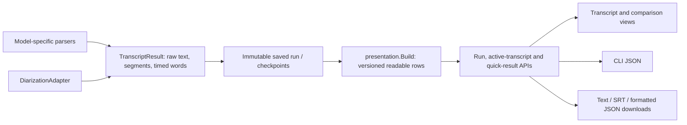

# Transcript output and presentation contract

The model integration boundary is `interfaces.TranscriptionAdapter`, which returns `interfaces.TranscriptResult`. Each adapter parses its own model's text, timestamps and native speakers. Separate diarization adapters return `DiarizationResult`; the shared merger assigns their speaker IDs to the transcript.

In C++ terms, these are an abstract adapter interface and a common result struct. `presentation.Build()` is a shared, deterministic projection of that result. A new recognizer implements the adapter contract; it does not need a model-specific React renderer.

## Separate acoustic segments from display rows

An adapter's `segments` are acoustic units. They may be long utterances, native speaker turns, unaligned audio windows or one segment per aligned word. Word-level units preserve speaker boundaries during diarization, but must not automatically become separate paragraphs.

The API retains every raw field and adds `transcript.presentation`. Quick results retain their existing JSON-string envelope, with the same field inside the decoded transcript:

- `version: 1` identifies the read-model contract.
- `grouping` is `native_segments` or `speaker_turns`.
- Each display segment has text, start/end bounds, an optional raw speaker ID and `word_indices`. A word has at most one row owner; clients must not reconstruct membership using a timestamp tolerance.
- `speaker_labels` provides readable defaults for opaque speaker IDs. Custom names take precedence. IDs remain unchanged, and matching numbers in different runs do not establish the same person's identity.
- `inferred_point_speakers` counts zero-duration words grouped with a speaker only when the timed words immediately on both sides have the same speaker and touch that exact time. Ambiguous speaker changes remain unassigned. Raw word speaker fields are unchanged.

The projection recognizes an exact one-to-one copy of timed words, including historical outputs without a granularity declaration. It groups these at speaker changes, sentence endings and pauses of at least one second, with limits of 30 seconds and 80 word records per row. It never removes repeated speech, changes spelling, adjusts word timestamps or sorts recognized words. Native phrase/turn boundaries and text remain intact. Overlapping native turns keep their own speaker attribution.

The frontend computes highlighting and seek offsets inside the exact row text using the supplied indices. Unmatched alignment tokens receive no highlight; they cannot replace or insert transcript text. SRT formatting rounds to milliseconds, including carry into the next second.

## Models sharing word-shaped output

The local ASR runner emits one acoustic segment per word for Qwen3 ASR, Cohere, ARK, Granite 4.1/5.0, MOSS Preview and Voxtral when word alignment is enabled. Granite 4.1 Plus also has native word timestamps and reaches that shared output constructor. MOSS Transcribe Diarize retains native turns by default, but explicit word alignment reaches the same constructor. BitNet uses the standalone aligner with the same word constructor. Canary, Canary-Qwen, Parakeet and WhisperX have separate adapters; their native phrase boundaries remain usable without word grouping.

Tests distinguish contract fixtures from model inference. They cover every selectable local-ASR ID and an unknown future ID with the same word-shaped fixture, native/overlapping turns, identical timestamps, ambiguous speakers, sentence/pause limits, word conservation, Unicode offsets, native text preservation and shared downloads. Existing saved output can be projected without running recognition or diarization again or rewriting stored recordings.
